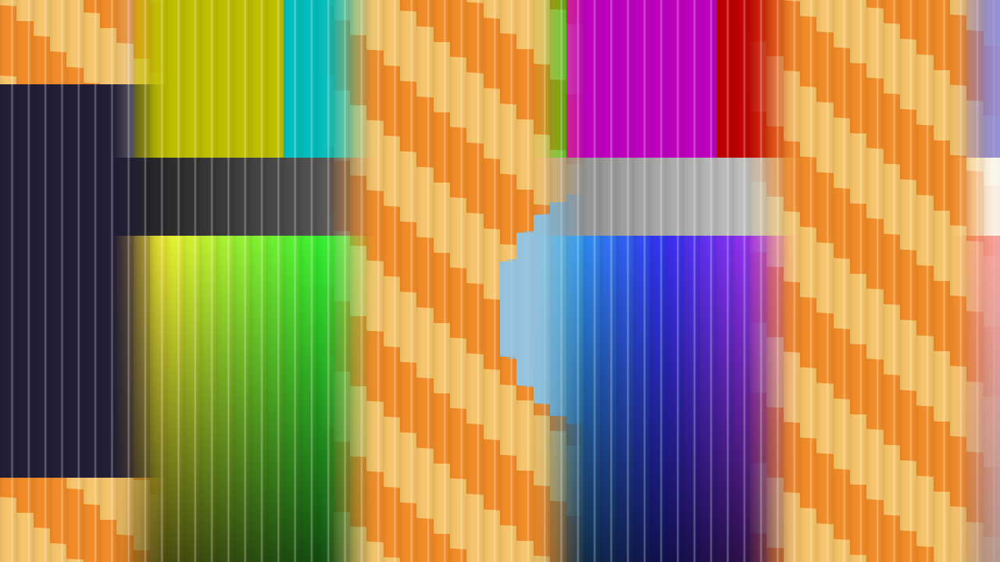

# Lenticular

> **AI-assisted project.** This codebase was created with [Claude](https://claude.com/claude-code)
> (Anthropic), directed and reviewed by a human author. The optics are not
> asserted but measured: an offline harness drives the real plugin class in a
> headless GL context with **two** input textures at two different resolutions
> and reads each claim back out of the picture — the card tilted all the way is
> A or B sampled at the lens pitch **bitwise, in all four channels**; the whole
> card flips square on and flips back at the edge of the viewing zone,
> atan( 1 / 2F ), to **6e-8 rad**; a pitch mismatch bands at
> 1 / | 1/p_L − 1/p_P | pixels, measured by FFT to **0.0009 cycles per picture
> width** in whole and fractional cases; a near viewer's flip lands at D sin T to
> **0.001 px** (see [Status](#status)). It has **never been loaded into
> Resolume**, on any platform. It is the fleet's fourth FFGL *mixer*, after
> genlock, wipe and relay. Check it in your own rig before trusting it in a show.

A printed lenticular sheet that shows one layer or the other, as an FFGL
**mixer** for [Resolume](https://resolume.com) Arena and Avenue. The layer's
opacity fader tilts the card.



<sub>The repo's two test cards through the plugin at Opacity 0.47 with the print
detuned from 60 to 62.7 periods a width — rendered by `lntest`, the offline
harness, not captured from Resolume. Each 21-pixel lens shows one sample of
whichever picture its focus lands on, so the picture is stepped; the ridges
catch the light as thin stripes; and because the print's pitch misses the
lens's, the flip happens in bands 466 px (about a third of the picture) apart, soft
where the focus straddles both strips.</sub>

## A lenticular card is two pictures and a sheet of lenses

A lenticular print is two pictures cut into thin strips and interleaved, A, B,
A, B, with a sheet of tiny cylindrical lenses on top, one lens per strip pair.
Each lens focuses the eye onto one point of the print under it, and which strip
that point is on depends on the angle the card is seen at. Tilt it and it flips.
Model the lens and the print, and everything a real card does falls out:

- **The flip.** A lens of focal length F focuses the rays arriving at angle t
  onto the print at F tan t from its axis. Square on that is the edge between
  the strips; tilt one way and it is on A, the other and it is on B; tilt past
  atan( 1 / 2F ) and the next lens's strips come round and the card flips back.
- **The ghost.** A real lens does not focus to a point. The eye sees the mean of
  the print across the focus spot, so near the flip it sees both pictures at
  once, and strip bleed on the print softens it further.
- **Moiré.** If the print's interleave pitch does not exactly match the lens
  pitch, each lens lands at a slightly different phase of the print, so different
  parts of the card flip at different angles and **bands** of A and B, of period
  1 / | 1/p_L − 1/p_P |, sweep across the picture as it tilts. That is exactly
  what a misregistered card looks like.
- **The sweep.** A viewer at a finite distance sees each column at its own
  angle, so the card does not flip all at once: the edge travels across it, at
  x = D sin T from the centre.
- **The ridged look.** Each lens shows one sample of the picture, so the picture
  is stepped at the lens pitch, and the ridges catch the light.

The interleave can squeeze each picture into its strips, as a real one does
(each strip holds its picture's band of one lens width, compressed), or not
(each strip is a window on the picture where it is). That is `Squeeze`.

**It is a mixer, not an effect.** It needs a layer below it: that layer is A,
printed in each lens's first strip, and the clip on this layer is B, in the
second. The layer's opacity tilts the card from A (0) to B (1).

## The controls

**Print** — Squeeze (on: the strips hold each picture squeezed, as a real
interleave does), Interleave Pitch (the print's periods of one A and one B strip
across the picture width, 4 to 480) and Bleed (the ramp between two strips, as a
fraction of a strip). Squeeze is first on purpose: Resolume Arena does not show
a mixer's first parameter (measured on genlock, wipe and relay), so index 0
holds a control whose default — on — is right if nobody can ever reach it.

**Lens** — Lens Pitch (lenses across the picture width, on the same scale as the
print's: the same slider position is the same pitch, which is what matched
means), Focal Length (0.5 to 6 lens pitches; the viewing zone is
atan( 1 / 2F ) either side of square on), Focus Spot (the lens's aberration, up
to half a lens) and Distance (the viewer, from half a picture width away to
infinity at the top of the slider, where the whole card flips at once).

**View** — Opacity (the tilt), Angle Range (how far Opacity 0 and 1 tilt the
card, up to 45°), Ridge Shine (the ridges' highlight and shading, and a slight
residual magnification in each lens) and Light Angle. **Opacity is the tilt**,
and it is named Opacity on purpose: Resolume binds a mixer parameter of that
name to the **layer's opacity fader**, and a layer transition ramps it
(measured on relay), so the layer's own fader, or a transition, tilts the card.

## Build

Needs CMake and the Resolume FFGL SDK, which is a submodule.

```bash
git clone --recursive https://github.com/stoatworks-labs/lenticular
cd lenticular
cmake -B build -DCMAKE_BUILD_TYPE=Release
cmake --build build
cmake --install build    # → ~/Documents/Resolume Arena/Extra Effects
```

macOS builds universal (arm64 + x86_64) by default. Add
`-DCMAKE_OSX_ARCHITECTURES=arm64` for a faster development build.

The install path is **Extra Effects**, although this is a mixer. Resolume has
one FFGL folder, and sources, effects and mixers all load from it: genlock, wipe
and relay were loaded from there by Resolume Arena 7.27.1 and offered as a
layer's Blend Mode and transition.

## Building and testing

The harness renders the real plugin class headlessly, with **two** inputs —
`--input-a` is A, the layer below; `--input-b` is B, this layer — which may be
different sizes, with different hardware padding, rendered to a third size.

    ./build/lntest --out /tmp/frame.png     both cards, through the plugin
    ./build/lntest --list                   every parameter, kind and default
    ./build/lntest --mixer                  two inputs, two MaxUVs, and the guards
    ./build/lntest --ends                   tilted all the way, A or B at the lens pitch, bitwise
    ./build/lntest --flip                   the whole card flips at the angles the lens predicts
    ./build/lntest --moire                  a pitch mismatch bands at 1/|1/p_L - 1/p_P|, by FFT
    ./build/lntest --distance               a near viewer's flip lands at D sin T
    ./build/lntest --opacity                Opacity tilts the card monotonically from -max to +max
    ./build/lntest --mutation               one character of the shipped GLSL fails --flip
    ./build/lntest --bench                  720p through 4K
    ./build/lntest --pipe --pipe-src F      two raw RGBA streams in, frames out (filming, not a check)
    python3 tools/sweep.py                  no control is silently dead
    tools/verify.sh                         all of it, on a fresh universal build

Every check runs at **two rasters**, 640×360 and 320×180, on this Mac's GPU
**and** on Apple's software renderer, and every tolerance is derived from
something stated — a float's rounding through a counted number of operations,
one source texel, one lens, a Hann window's leakage from the picture's own other
spectral lines, a ramp's two kinks in a pixel sum — rather than from the number
this machine printed first. Each check carries a **negative control**, shipped
in the plugin as a fault switch the harness can throw: A's MaxUV folded into the
vertex shader, the focus at F sin t instead of F tan t, the viewer's distance
ignored, the lens pitch forced to the print's, the tilt reversed.
[AGENTS.md](AGENTS.md) lists every number and where it comes from.

## Status

**v0.1.0, local, unreleased, and honestly early.** Verified by measurement on an
Apple M4 Max, macOS 26.4.1, 2026-09-25, at 640×360 **and** 320×180 unless
stated, on the GPU and on Apple's software renderer:

| Check | Result |
| --- | --- |
| Two inputs, two sizes, two MaxUVs | A 200×120 of 256×256, B 96×70 of 128×128, out 320×200 and 320×180, through a sheet of 2-pixel lenses: **0 padding pixels** reached the picture at either end or with both inputs in one frame, every quadrant within **0.000 of 255**, the marker within one source texel (plus half a lens across) |
| The missing-input guards | a null input array, zero inputs, one input, a null A and a null B all return `FF_FAIL` without crashing |
| Tilted all the way | Squeeze on and off, Opacity 0 and 1: the card is A or B sampled at the lens pitch, **0 bytes wrong in all four channels**, on a card of three sub-blocks and four bands a lens with alpha from 64 to 255, every sample at least 1.67 texels inside its sub-block |
| The flip | F 1.2, 1.8 and 3.0: A to B square on and back at ±atan( 1 / 2F ) (±22.62°, ±15.52°, ±9.46°), measured off the ramp a 0.2-lens focus spot makes, worst **6.0e-8 rad** off (tolerance 1e-5, derived bound 9.1e-7); every pixel of the card the same B fraction (bitwise on the GPU, within 6e-8 on the software renderer) |
| Moiré | 64 lenses against 56, 57.5 and 69.25 print periods: band periods **79.998, 98.475 and 121.916 px** against 1/|1/p_L − 1/p_P| = 80.000, 98.462 and 121.905 (**0.0002, 0.0009, 0.0005 cycles a width**; tolerance 0.02, derived leakage bound ≤ 0.003); a tenth of a lens of focus moves the bands 0.5466, 0.5651 and 0.6805 rad against 0.5498, 0.5645 and 0.6799 (tolerance 0.03, derived bound ≤ 0.009) |
| Distance | D 1.5 and 3 widths, five tilts each: the flip lands at W (½ + D sin T) to **0.0009 px** worst (tolerance 0.05, derived bound ≤ 0.0035) |
| Opacity | 21 steps rise strictly, from −6.34019° to +6.34019°, each within **5.5e-8 rad** of (2o − 1) × Angle Range |
| Mutation | one character of the shipped GLSL — the strip edge moved a tenth of a period off the lens axis — fails **3 of 3** `--flip` crossings; the shipped text through the same hook passes and renders the default path's bytes. By hand: the viewer's offset added instead of subtracted fails **17** `--distance` assertions and nothing else |
| Negative controls | every one fails its check: folded MaxUV (4 and 5 assertions), F sin t (2 crossings), distance ignored (2 of 2 tilts), pitch locked (2), tilt reversed (not monotone; sweep the wrong way) |
| No dead controls | all **11** controls change the picture at 480×270, both inputs present; the other four parameters are the About block |
| Pipe | 3 frames in, 3 out; Opacity ramps and Squeeze steps between cues; a closed stdout is **exit 1** |
| macOS binary | universal (`x86_64 arm64`), exports `plugMain`, ad-hoc signs |
| Host metadata | `oxbow probe` reads **SW Lenticular / LN01 / mixer / inputs 2..2**, parameter 0 **Squeeze** |
| Render cost | **0.021 ms/frame at 720p, 0.035 at 1080p, 0.10 at 4K** (0.6% of a 60 fps frame), worst of three runs on a shared machine |

Run `tools/verify.sh` before believing any of it.

**Not done, and the list is honest.** Lenticular has **never been loaded into
Resolume** on macOS or Windows; everything above was measured offline, through
the real plugin class. What Arena does with a mixer — Blend Mode and transition,
index 0 hidden, `Opacity` bound to the layer's fader, inputs padded — is
inherited from genlock, wipe and relay, not re-measured here. There is no GitHub
repo, no CI run and no Windows build yet (the workflows exist and have never
run). The harness has run on two rasterisers, this Mac's GPU and Apple's
software renderer; never llvmpipe or another GPU. The ridge highlight, the edge
shading and the residual magnification are looks, not a model of any sheet; the
lens is a thin lens in air, with no refraction into the plastic. No user guide,
no presets, no OpenFX port, no browser demo.

[AGENTS.md](AGENTS.md) has the full list of what is assumed rather than
measured, the open questions, and the traps.

<!-- attributions:start -->
This project is built on other people's work — see [ATTRIBUTIONS.md](ATTRIBUTIONS.md).
<!-- attributions:end -->

## Licence

MIT — see [LICENSE](LICENSE).
