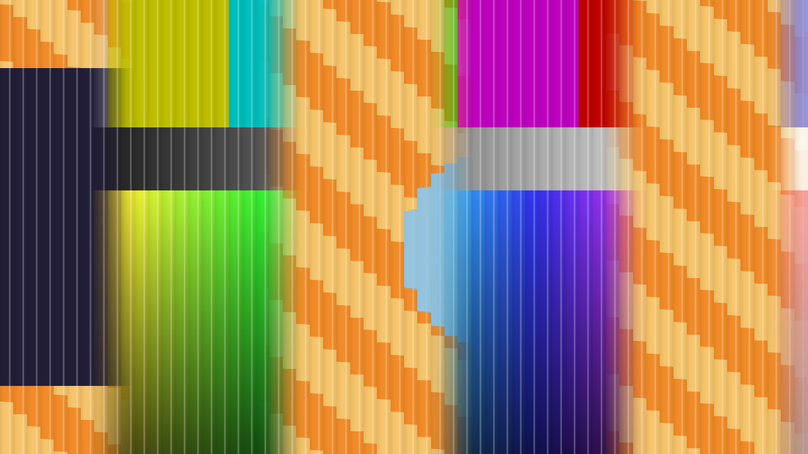

# Lenticular user guide

Lenticular is **a printed lenticular sheet that shows one layer or the other**, as an
FFGL **mixer** for [Resolume](https://resolume.com) Arena and Avenue. The layer below
and this layer are cut into strips and interleaved under a sheet of cylindrical
lenses, and the layer's opacity fader tilts the card. Each lens focuses the eye onto
one point of the print, so the card flips from one picture to the other square on,
flips back at the edge of the viewing zone, shows both pictures near the flip,
bands into moiré when the print's pitch misses the lens's, and is stepped and ridged
at the lens pitch. None of that is painted on: it falls out of the lens and the print.

The same card also builds as an **OpenFX transition** for DaVinci Resolve and Vegas
Pro, where the transition itself tilts the card — see
[As an OpenFX transition](#as-an-openfx-transition-resolve-and-vegas).



*The repo's two test cards through the plugin at Opacity 0.47 with the print
detuned from 60 to 62.7 periods a width. Rendered by the offline harness, not
captured from Resolume. Each 21-pixel lens shows one sample of whichever picture its
focus lands on; the ridges catch the light as thin stripes; and because the print
misses the lens, the flip happens in bands about a third of the picture apart.*

> **Before you rely on this:** released at **v0.2.0**, which added the OpenFX
> transition for Resolve and Vegas, and honestly early. The optics
> are measured, not just asserted. An offline harness drives the real plugin with two
> inputs at two different sizes, on the GPU and on Apple's software renderer. Tilted
> all the way, the card is A or B sampled at the lens pitch, **0 bytes wrong** in all
> four channels. It flips square on and flips back at ±atan( 1 / 2F ) to
> **6e-8 rad**. A pitch mismatch bands at 1 / | 1/p_L − 1/p_P |, measured by FFT to
> **0.0009 cycles per picture width**, and the bands sweep by the predicted phase. A
> near viewer's flip lands at D sin T to **0.001 px**. Every check carries a negative
> control that fails, and all 11 controls change the picture.
> It has **never been loaded into Resolume on macOS**.
> On Windows, a build of v0.1.0 loads in Resolume Arena 7.27.1, is offered as a layer's Blend Mode and as a transition, has its tilt driven by the layer's opacity fader and by a layer transition, and hides only Squeeze, as designed — on software rendering, and no picture of it inside Resolume has been captured, so a correct render there is not yet shown.
> The OpenFX transition renders with a C++ copy of the plugin's shader, compared with
> the graphics card's render pixel by pixel to within 0.65 of 255, and in a test
> OpenFX host it matches the Resolume plugin's picture to 1 of 255. In
> **DaVinci Resolve Studio 21.1** on macOS it plays on the Edit page with the clips
> the right way round, and Resolve's frames are identical to that test host's. It
> has **never been loaded into Vegas**, nor into any host on Windows or Linux.
> **Try it on a spare layer first**, and please report anything that misbehaves.
>
> This codebase was created with AI assistance, directed and reviewed by a human
> author.

---

## Installing

Download the build for your platform. For macOS there is a universal `.dmg` or
`.zip` (Apple silicon and Intel), **Developer ID-signed and notarised** so the bundle
simply loads (the signing happens on the maintainer's Mac shortly after each release
is published, so a download made in the first minutes may need **Open** from the
context menu once), and for Windows an x64 installer or `.zip`. Every download carries one mixer, **SW Lenticular**. Put it in Resolume's
FFGL folder, then restart Resolume:

```
macOS    ~/Documents/Resolume Arena/Extra Effects/
Windows  %USERPROFILE%\Documents\Resolume Arena\Extra Effects\
```

Avenue uses the same layout in its own folder. It really is **Extra Effects**, even
though this is a mixer: Resolume has one FFGL plugin folder, and sources, effects and
mixers all load from it. There is no `Extra Mixers`.

A mixer does not appear in the effects browser. In Resolume it appears in a layer's
**Blend Mode** list, beside Resolume's own blend modes, and in the layer's
**transition** list. Choose **SW Lenticular** as the blend mode of the upper layer.

The Windows builds are not code-signed. Plugin files are not gated the way `.exe`
files are, so Resolume loads them as normal; only the installer trips SmartScreen,
once: **More info** → **Run anyway**.

**For Resolve or Vegas**, take the OpenFX zip for your platform instead (from
v0.2.0: `lenticular-ofx-macos-universal.zip`, `lenticular-ofx-windows-x86_64.zip`
or `lenticular-ofx-linux-x86_64.zip`) and copy `Lenticular.ofx.bundle` into the
standard OpenFX folder, then restart the host:

```
macOS    /Library/OFX/Plugins/
Windows  C:\Program Files\Common Files\OFX\Plugins\
Linux    /usr/OFX/Plugins/
```

It is a **transition**, not an effect: it appears among the host's transitions, as
**Stoatworks → Lenticular**.

---

## It is a mixer, not an effect

An effect gets one picture. A mixer gets two, and Lenticular needs both:

| Input | In the code | In Resolume | What it is here |
|---|---|---|---|
| **A** | `inputTextures[0]` | the layer **below** | Printed in each lens's first strip. The card shows it tilted to Opacity 0. |
| **B** | `inputTextures[1]` | **this** layer, the one whose Blend Mode is SW Lenticular | Printed in the second strip. The card shows it tilted to Opacity 1. |

Put one clip on a layer and the other on the layer **above** it, then set the upper
layer's **Blend Mode** to SW Lenticular. Handed only one picture, the plugin declines
to draw. The two layers do not have to be the same size; each input is read at its
own resolution.

---

## As an OpenFX transition (Resolve and Vegas)

The OpenFX build is the same card in a host's transition slot. The two layers and the
fader map one to one:

| | In Resolume (the mixer) | In Resolve or Vegas (the transition) |
|---|---|---|
| **A**, the first strip | the layer below | the **outgoing** clip (OpenFX calls it SourceFrom) |
| **B**, the second strip | this layer | the **incoming** clip (SourceTo) |
| **The tilt** | the layer's opacity fader | the transition's own progress |

So the card starts tilted to the outgoing clip (−Angle Range), is square on halfway
through, where it flips, and ends tilted to the incoming one (+Angle Range). Make the
transition longer to tilt more slowly; change **Angle Range** to tilt further.

Every other control is the same control, with the same name, range, default and
group, and does the same thing — the OpenFX build uses the plugin's own parameter
arithmetic and a line-for-line copy of its shader. The differences:

- **There is no Opacity control.** The transition's progress is the tilt.
- **Two extra controls, Ends and End Length**, under **Ends**. The lens itself has no
  end stops: tilted all the way, the card still shows the outgoing clip *through the
  lens*, stepped and ridged. So by default (**Ends = Fade**) the transition starts on
  exactly the outgoing clip and finishes on exactly the incoming one: over the first
  **End Length** of the transition (0.15, so the first 15%, by default; up to 0.5)
  the card fades in from the plain outgoing clip, and over the last it fades out to
  the plain incoming one, smoothly, while the card keeps tilting. Resolve renders
  each frame of a transition at that frame's middle, never at exactly its start or
  end, so there the first and last frames of the transition still carry a faint
  trace of the card — about 5% of it on a 24-frame transition at the default End
  Length — and the plain clip is the next frame. A longer End Length or a longer
  transition makes the trace fainter. **Ends = Cut**
  shows the card from the first frame to the last, cutting to it and away from it —
  exactly what Resolume does.
- **Squeeze is shown.** Resolume hides it; an OpenFX host shows every control.
- **Only hosts with OpenFX transitions list it.** It is not offered as a clip effect
  anywhere, and Nuke, which has no OpenFX transitions, does not show it at all.
- Clips of another size than the timeline are stretched to fill it, as Resolume
  stretches each layer.

It runs on the computer's processor, not the graphics card: about 8 ms a 1080p frame
on 8 threads of an M4 Max, 40 ms on one.

---

## Start here

**The layer's opacity fader tilts the card.** Lenticular's tilt is a parameter called
**Opacity**, and Resolume drives a mixer parameter of that name from the layer's own
opacity fader. So once SW Lenticular is the upper layer's blend mode, that layer's
opacity is the tilt: at 0 the card is turned to show the layer below, at 1 this
layer, and at 0.5 it is seen square on, which is where it flips.

**When you first choose SW Lenticular, you see this layer, through the lens.** Opacity
defaults to 1 and in Resolume the layer's fader is usually at 1 anyway. It is not
the plain clip: at every setting the picture is seen through the sheet, stepped at
the lens pitch and ridged. That is the product.

Then, in this order:

1. **Tilt.** Move the fader from 0 to 1 slowly. At the default Distance (a viewer five
   picture widths away) the flip does not happen all at once: its edge travels across
   the card, from one side to the other, around the middle of the fader.
2. **Distance** all the way up, to infinity. Now every lens sees the card at the same
   angle and the whole card flips at once.
3. **Focus Spot** and **Bleed** up, and the fader near the middle. Each lens now sees
   both strips, and the card shows both pictures: the ghost of a real card.
4. **Interleave Pitch** a little away from **Lens Pitch**, and tilt again. The card
   flips in vertical bands that sweep across it: moiré.
5. **Angle Range** up to 40°. The fader now turns the card past the edge of its
   viewing zone, and it flips back, and again.

---

## Print

**Squeeze** (on): whether each strip holds its picture's band of one lens width,
squeezed into half a lens as a real interleave does (on), or is a window on the
picture where it is (off). **Resolume Arena does not show a mixer's first parameter**,
and Squeeze is first on purpose: its default is right if nobody can ever reach it.
Checked in Arena 7.27.1: of the sixteen parameters, Squeeze is the one it hides, so in
Resolume Arena the strips are always squeezed.

**Interleave Pitch** (4 to 480 periods across the picture width, geometric; 60 by
default): how many A-and-B strip pairs the print has across the picture. It is on the
same scale as Lens Pitch, so the same slider position is the same pitch, bit for bit:
that is what "matched" means, and it is the default.

**Bleed** (0 to 1 strip; 0.1 by default): the ramp between two strips on the print,
as a fraction of a strip. Higher softens the flip and widens the ghost.

---

## Lens

**Lens Pitch** (4 to 480 lenses across the picture width, geometric; 60 by default).
Each lens shows one column of its picture spread across its width, so the picture is
stepped at this pitch: 60 across a 1920-wide composition is 32 pixels a lens. Move it
with Interleave Pitch to keep them matched; move one alone for moiré.

**Focal Length** (0.5 to 6 lens pitches, geometric; 1.8 by default): where the print
sits behind the lens. The viewing zone is ±atan( 1 / 2F ) either side of square on:
±15.5° at 1.8, ±22.6° at 1.2, ±9.5° at 3. Past the zone the next lens's strips come
round and the card flips back.

**Focus Spot** (0 to half a lens; 0.1 of a lens by default): the lens's aberration. The
eye sees the mean of the print across the spot, so near a strip edge it sees both
pictures. At the ends of the tilt the spot sits wholly on one strip and this changes
nothing; it shows around the flip.

**Distance** (from half a picture width to infinity at the top of the slider; five
widths by default): how far away the viewer is. A near viewer sees each column at its
own angle, so the flip travels across the card, landing at D sin T from the centre for
a tilt T. At the top of the slider the viewer is at infinity and the whole card flips
at once.

---

## View

**Opacity**: the tilt. In Resolume this is the **layer's opacity fader**, and the
mixer's own Opacity control is overridden by it; see *Start here*.

**Angle Range** (0 to 45°; 8° by default): how far Opacity 0 and 1 tilt the card either
side of square on. At the default Focal Length, 8° lands the ends in the middle of
each strip, as far from a flip as the lens allows. Above 15.5° the fader crosses the
edge of the viewing zone.

**Ridge Shine** (0 to 1; 0.3 by default): the ridges' highlight and edge shading, and a
slight residual magnification in each lens. At 0 the lens is ideal.

**Light Angle** (−60° to +60°; 25° by default): where the light comes from, which moves
the highlight across each ridge.

---

## How it works: the lens and the print

Across the picture there are N_L lenses and, under them, N_P interleave periods,
each an A strip then a B strip. A thin cylindrical lens of focal length F focuses
rays arriving at angle t onto its focal plane at F tan t from its axis, and the print
is in that plane. So the eye looking at a column under lens k sees the print at
k + ½ + F tan t lens pitches, and the fraction of that point's print period says
which strip it is on: under a half, A; over, B.

With matched pitches and the viewer at infinity that fraction is the same under every
lens, so the whole card flips at once: to B as tan t crosses 0, back to A as F tan t
crosses ½. With mismatched pitches the fraction advances by N_P / N_L a lens instead
of by a whole period, so the flip happens in bands W / | N_L − N_P | pixels apart that
move as the card tilts. With the viewer at a distance D each column is seen at its own
angle, so the flip lands at x = D sin T. The focus spot is a box; the coverage of the
print across it is a closed form, so a spot wholly on one strip returns exactly that
strip's picture.

There is no clock and nothing is kept from one frame to the next: the card moves only
when the fader, a control or the clips do.

---

## Performance

It is one pass with two texture reads. The worst figures from the offline harness on
an Apple M4 Max:

| | ms/frame | Share of a 60 fps frame |
|---|---|---|
| 1280×720 | 0.021 | 0.1% |
| 1920×1080 | 0.035 | 0.2% |
| 2560×1440 | 0.055 | 0.3% |
| 3840×2160 | 0.114 | 0.7% |

At this size the measurement costs about as much as the work, so take the ceiling. No
timing has been taken inside Resolume.

The OpenFX transition runs on the processor instead: about **8 ms** a 1080p frame on 8
threads of an M4 Max in a test host, **40 ms** on one thread. No timing has been taken
inside Resolve or Vegas.

---

## If it looks wrong

**The picture is always stepped and striped, even at the ends.** That is the sheet. A
lenticular card never shows the plain picture; Opacity 0 and 1 are A and B *through
the lens*. Raise Lens Pitch for finer steps, lower Ridge Shine for fainter ridges.

**The flip happens in stripes that will not go away.** Interleave Pitch and Lens Pitch
are not matched. Set them to the same slider value.

**Moving the Opacity slider does nothing.** That is Resolume overriding it with the
layer's opacity fader. Use the layer's fader.

**Focus Spot and Bleed do nothing.** At the ends of the tilt the focus sits in the
middle of one strip, so neither shows. Move the fader to the middle.

**A transition with SW Lenticular pops at the end.** Used as a layer's transition, the
card tilts from the old clip to the new one, but the new clip is still seen through
the lens on the transition's last frame, and then Resolume shows it plain. In Arena
7.27.1 the last transition frame had Opacity 0.94 to 0.99, never 1: the card was
already showing the new clip, stepped and ridged, and the plain clip replaced it in
one frame. It is the lens having no end stops, not a fault. To avoid it, use SW
Lenticular as the layer's Blend Mode and move the layer fader instead, or keep a
lenticular look on the new clip afterwards. (The OpenFX transition fades the card in
and out at its ends by default; its **Ends = Cut** is this behaviour.)

**The mixer does nothing at all.** A shader that fails to compile looks exactly like
that. The plugin writes a small log:

```
macOS    ~/Library/Logs/lenticular/lenticular.YYYY-MM-DD.log
Windows  %LOCALAPPDATA%\lenticular\logs\lenticular.YYYY-MM-DD.log
```

It records the host's name and version and the file it was loaded from, the GL
vendor, renderer and version, the first frame's input sizes, each Opacity change (up
to 400 an instance, numbered, so a transition's own instances can be told from the
layer's), the last Opacity when an instance is freed, and an error line if the shader
failed to compile.

---

## Known limits

- **Squeeze is hidden in Resolume.** Arena does not show a mixer's first parameter,
  so Lenticular puts Squeeze there on purpose, and in Resolume it is always on.
  Checked with Lenticular in Arena 7.27.1 on Windows: the one hidden control is
  Squeeze.
- **The tilt is the layer's opacity.** In Resolume the mixer's own Opacity slider is
  overridden by the layer's opacity fader, so it cannot be set or automated
  separately. A layer **transition** does drive it (checked in Arena 7.27.1: a 2 s
  transition ran its own instance of the mixer from Opacity 0.007 to 0.944), and it
  ends with the pop described under *If it looks wrong*.
- **Never loaded into Resolume on macOS.** In Resolume on Windows it has run only on
  software rendering, and its picture there has not been captured. No graphics card
  but the Mac it was built on has run it.
- **The optics are a model**: a thin lens in air (no refraction into the plastic), a
  box focus spot, a print with linear ramps, the viewer's eye as a point. The ridge
  highlight, the edge shading and the residual magnification are looks, not a
  measurement of any sheet.
- **Vertical lenticules only**, and **two frames only**: the ghost is the in-between.
- **Output alpha is the seen picture's**: the mix of A's and B's alpha by how much of B
  the lens sees, with the ridge highlight laid over it.
- **No presets.**
- **The OpenFX transition has been in one production host**, DaVinci Resolve Studio
  21.1 on macOS, on the Edit page: the clips the right way round, the frames either
  side of it the clips exactly, and every frame of it identical to a test OpenFX
  host's render, which is checked pixel by pixel against the Resolume plugin's. That
  was opaque clips at full resolution, at the default settings; transparent clips
  and proxy renders in Resolve are not yet checked. It has **never been loaded into
  Vegas**, nor into any host on Windows or Linux.
- **There is a browser demo** at [lenticular-demo.stoatworks-labs.com](https://lenticular-demo.stoatworks-labs.com).
  It is a port to a web page, not the plugin: the shaders run in WebGL2, the
  parameter conversions are rewritten in JavaScript, and the two pictures are
  generated test clips. The page lists what it does not reproduce.

---

## About

The last group, **About**, carries a credit line (name, version, licence and maker) and
buttons that open this user guide, the project page, the source on GitHub and the
support page in your browser.

## Reporting something

[github.com/stoatworks-labs/lenticular/issues](https://github.com/stoatworks-labs/lenticular/issues).
A screenshot, your Resolume version, the settings, the composition's resolution and
frame rate, and the day's log are usually enough.
